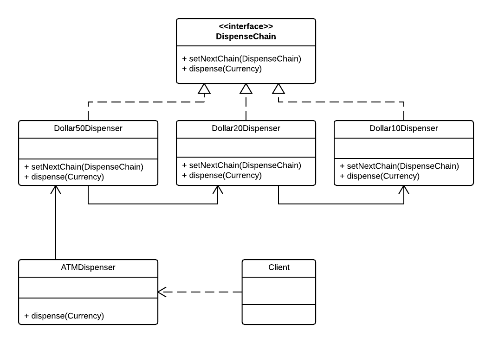

### Decorator pattern

#### A behavorial pattern

Achieve lose coupling in software design where a request from client is passed to a chain of objects to process them. A well known example is the try - catch exception handling chaining in JDK

Source code stems from the following UML diagram:

